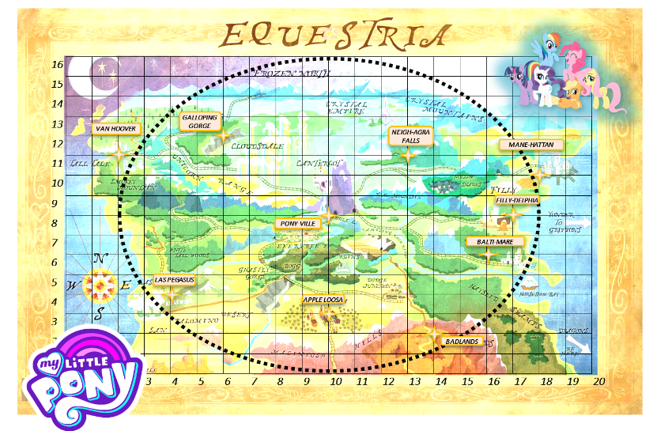
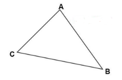
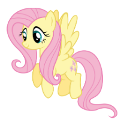
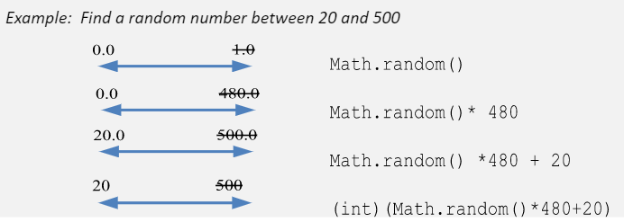

# Instructions for Equestria Math Project

* **Use Java's Math class to help RainbowDash and their friends to navigate around the kingdom of Equestria!**
* _Work productively with your partner.  One should be **"driving"** & the other **"navigating"**._
* _Please complete all your programming components of your Equestria project on here in REPLIT with your partner.  Use only one ```main()``` method to call and test all the methods described in the handout.  Instructions can also be found in Google Classroom or paper handout._
 

 


# Exercise 1: Get Trip Distance
Rainbow Dash has lots of dashing to do and wants to know how far it will be between different Equestria cities.


(1A) Complete the method called ```getDistance()``` that:
* ~~accepts four integer coordinates: x1, y1, x2, y2 as parameters~~
* calculates the distance between points (x1, y1) and (x2, y2) on the map
* ~~returns that distance.~~

		JAVA Math CLASS NOTES:
		The equation for the distance is:
_d= (x2-x1)<sup>2</sup>+ (y2-y1)<sup>2</sup>_
		
		Q. Which Math method will help you calculate a square root in Java?  
		Q. Which Math method will help you square something in Java?


(1B) Use the  ```main()``` method in order to test out your ```getDistance()``` method, which should:
* call the ```getDistance()``` method 3 times (Once for each of the following pairs of cities)
* output to the console each value returned by the ```getDistance()``` method. 

		Distance from Balti-mare (16, 6) to Mane-hattan (18, 10)=				
		Distance from Los Pegasus (4,4) to Neigh-agra Falls (13,11)=			
		Distance from the Badlands (14,2) to Pony-ville (10, 8)=				


# Exercise 2: Trip Circumference
Princess Luna and Celestia are going on a trip around the kingdom to greet the other citizens of Equestria.  Their trip takes them on a circular path (see map).  


(2A) Complete another method in your program called ```getTripCircumference()``` that
* ~~accepts as a parameter the diameter of the circular path~~
* calculates the total length of the trip
* ~~returns the length of the trip~~

		JAVA Math CLASS NOTES:
		The equation for circumference of a circle is :   c= π*d
		
		Q. Which Math class constant can  access the value of pi in Java?  


(2B) Test your ```getTripCircumference()``` method by calling it in your ```main()``` method, using an actual parameter:
* Each box on the map represents 1 mile.  Count the boxes to determine the actual diameter (_______ miles) to use as the parameter for this method call.
* Trip Circumference =			 miles


# Exercise 3: Three-city Equestria Tour
Princess Luna is planning a 3-city tour of Equestria, and needs assistance with directions.  
(No, Equestria does not have Google Maps Directions yet!)  She has requested a program that will output the distance between the three destinations, and the angles between each pair of cities.


(3A) Decide on the 3 cities that you want Princess Luna to tour:
(If you can’t see coordinates clearly on the map, you can use coordinates of cities from Exercise 1.)

		CITY A = 					 (	, 	)
		CITY B= 					 (	, 	)
		CITY C= 					 (	, 	)



(3B) In your ```main()``` method, use the ```getDistance()``` method from Exercise 1 three times to find the distances between the cities. Store each of the values of the distances with their own variable:

_Hint: Use print statements to check what the values are._

		Distance AB = 		 miles
		Distance BC = 		 miles
		Distance AC = 		 miles

(3C) Complete another method in your program called ```getAngle()``` that 
* ~~accepts as a parameter the distances between the 3 cities from Part B.~~
* calculates the angle between the 3 cities.
* ~~returns the angle between the 3 cities.~~

		JAVA Math CLASS NOTES:
		Use the Law of Cosines:
_(AB)<sup>2</sup>= (BC)<sup>2</sup>+ (AC)<sup>2</sup>-2*(BC)*(AC)*cos(angleC)_
		
		If you solve for angleC =    
_(angleC) = cos<sup>-1</sup>( ( (AB)<sup>2</sup> - (BC)<sup>2</sup> - (AC)<sup>2</sup>) / (-2 * (BC) * (AC) ) )_

		Q. What Math class method will find the inverse cosine in Java?  
		Q. What Math class method can easily convert radians to degrees in Java?  

(3D) In your  ```main()``` method, use the ```getAngle()``` method from Exercise 3 three times to find the angles between the cities.
_Hint: Use print statements to check what the values are._

		Angle A = 		 degrees
		Angle B = 		 degrees
		Angle C = 		 degrees
(3E) Print to the console a summary of the directions – the angles and distances – that should look something like the output below:

		From City A, turn 90.0 degrees and fly 25.1 miles to reach City B.
		From City B, turn 151.3 degrees to your right and walk 62.5 miles to reach City C.
		To return to City A from City C, turn 119.7 degrees to your right and walk 33.3 miles.

_Hint: check your directions by trying them out yourself._


# [EXT] Exercise 4: Longest Trip 
Fluttershy wants to accompany Princess Luna on the overall trip, but cannot fly for more than 50 miles without falling out of the sky.  She needs to check how long the longest leg of her trip will be.



(4A) Write a method called ```longestTrip``` that:
* ~~accepts parameters for 3 locations (each containing coordinates)~~

		(How many total parameters? ________ )

* calculates  the longest distance between any pair of destinations.
* ~~returns the longest distance between any pair of destinations.~~

_Hint: You should use the distances from Exercise 3(b) for this._

(4B) Test out your method by calling it in the main method using the coordinates for the 3 cities from Exercise 3:

		Longest Trip Length = 		 miles
.

		JAVA Math CLASS NOTES:
		Q. What Math class method finds the larger value between 2 numbers in Java? 


(4C) [EXT] Rewrite the method to accept 4 locations!


# Exercise 5: Soarin-Dash Random Vacation
Soarin Skies and Rainbow Dash can’t decide how far to travel for their vacation, so they decide to choose a random number at least 25 miles away, but no more than 150 miles away.


(5A) Complete another method in your program called ```getRandomTrip()``` that:
* calculates the random distance for a trip as an int
* ~~returns the length of the trip as an int~~

(5B) In the  ```main()``` method, test out your ```getRandomTrip()``` method.

		JAVA Math CLASS NOTES:
		Q. How do you generate a random number between 0.00 and 1.00?  	
		Q. What data type does Math.random() return?




